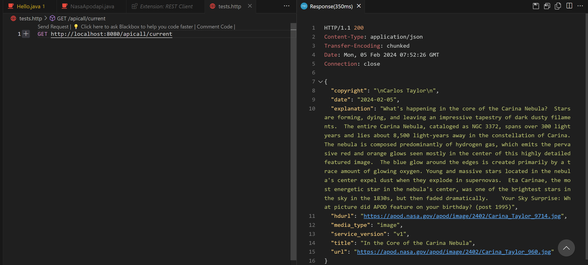
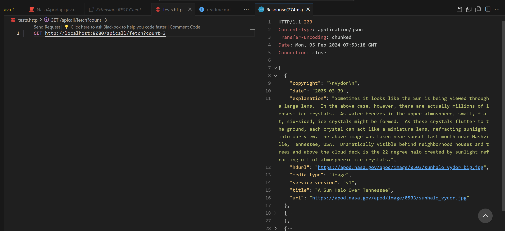
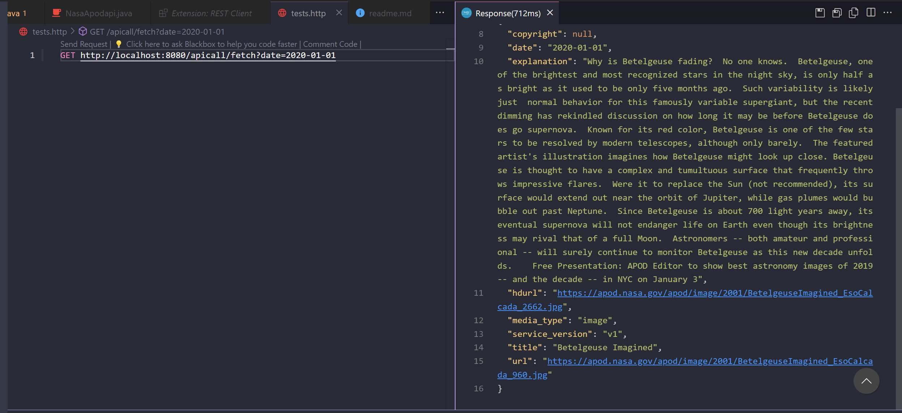
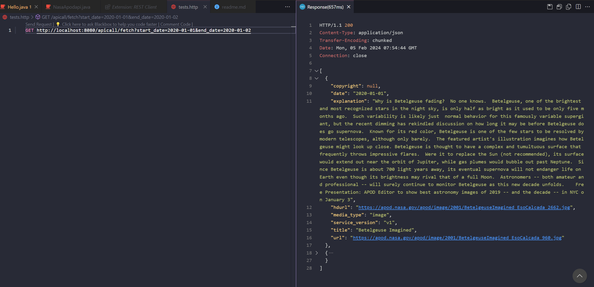

---

# Spring Boot NASA APOD API Integration

## Introduction

This Spring Boot application provides a simple yet powerful interface for interacting with NASA's Astronomy Picture of the Day (APOD) API. It offers endpoints to fetch the astronomy picture of the day based on specific parameters like date, start and end dates for historical data, or a count for random selections. Additionally, it includes functionality to fetch the current day's astronomy picture without any input parameters. This project is ideal for educational purposes, astronomy enthusiasts, or any application requiring daily space-related imagery and information.

## Capabilities

- Access today's Astronomy Picture of the Day directly.
- Acquire data on past APOD entries through specific dates or by specifying a period.
- Generate a collection of random APOD images by determining a desired quantity.
- Ability to request thumbnail URLs to be included in the output.

## API Endpoints

### Fetch APOD Data

**URL:** `/apicall/fetch`

**Method:** `GET`

**Query Parameters:**

- `date`: Date of the picture to fetch (format: YYYY-MM-DD).
- `start_date`: Start date for a range of dates to fetch pictures.
- `end_date`: End date for a range of dates to fetch pictures.
- `count`: Number of random pictures to fetch.
- `thumbs`: Include thumbnail URLs in the response (`true` or `false`).

### Fetch Current APOD

**URL:** `/apicall/current`

**Method:** `GET`

No parameters required. Fetches the current day's APOD.

## Setup and Installation

### Prerequisites

- JDK 11 or later
- Gradle

### Steps

1. **Clone the repository**

```sh
git clone https://github.com/Akshith-github/ubiquitous-enigma
```

2. **Navigate to the project directory**

```sh
cd [project-name]
```

3. **Build the project**

```sh
gradle build
```

4. **Run the application**

```sh
gradle bootRun
```

The application will start and be accessible at `http://localhost:8080`.

## Using the API

To use the API, send HTTP GET requests to the endpoints defined above with the desired query parameters. You can use tools like Postman, curl, or any HTTP client in a programming language of your choice.

Example request to fetch the current APOD:

```sh
curl http://localhost:8080/apicall/current
```







